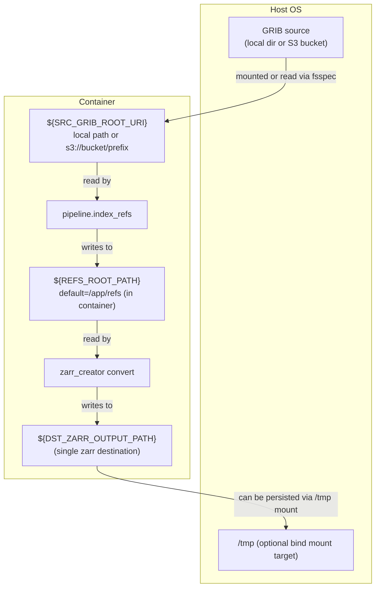
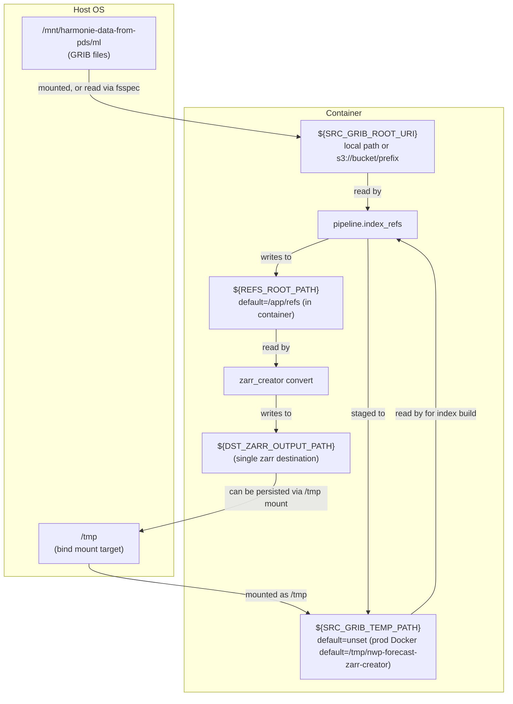

# NWP Forecast in zarr format

This repository contains the code to process DINI and IG GRIB files into zarr format.

For local VS Code + Docker development, see [DEVELOPING.md](DEVELOPING.md).

Currently, this writes all pressure-level fields to `pressure_levels.zarr`,
height-level fields to `height_levels.zarr` and everything else to
`single_levels.zarr`. We do not currently transfer and convert model-level
fields. These are written e.g. to

`s3://harmonie-zarr/dini/control/2025-03-03T060000Z/single_levels.zarr`

The general prefix format is:

`s3://harmonie-zarr/{suite_name}/{member}/{analysis_time}/{part_id}.zarr`


NB: note that for DINI we have fewer height-levels and so I have only included `50m`, `100m`, `150m` and `250m`. In addition a number of variables aren't in DINI or at least I don't understand what the variables that are there all mean. To see what is included please have a look at [zarr_creator/config.py](zarr_creator/config.py).


## Usage

### Periodic running

For continuous operation run the pipeline watcher, e.g. in a tmux session
(or as the container entrypoint, which does this by default):

```bash
uv run python -m zarr_creator run --watch
```

This polls for the latest 3-hourly analysis time every 5 minutes, builds
indexes/refs when missing, and converts to zarr (retrying on failure).
For a single analysis time (cron / Kubernetes Job), omit `--watch` and
optionally pass `--t-analysis`:

```bash
uv run python -m zarr_creator run --t-analysis 2025-02-27T15:00:00Z
```

### Manually running

Running the conversion manually requires two steps:

1. Build GRIB indexes and refs:

```bash
uv run python -m zarr_creator.pipeline.index_refs --t-analysis 2025-02-27T15:00:00Z
```

This writes refs to `refs/`. If you want to stage source GRIB files in a
temporary location before indexing (recommended for S3 sources), set
`SRC_GRIB_TEMP_PATH` as an environment variable.

2. Read the refs, build the three datasets (height-levels, pressure-levels and single-levels) as `xr.Datasets` and write each to the configured output:

```bash
uv run python -m zarr_creator --t_analysis 2025-02-27T15:00:00Z --suite-name DINI
```

`suite-name` can optionally be set to `DINI` (default) or `IG`.
Output destinations come from `DST_ZARR_OUTPUT_PATH` (default:
`file:///tmp/{suite_name}-recent/{dataset_id}.zarr`, i.e. local only).

## Runtime Defaults

Shared runtime defaults are defined in `zarr_creator/settings.py` (one module
per setting, each mapped 1:1 to an environment variable).

**Configuration precedence: CLI flag > environment variable > built-in
default.** The container is configured purely via environment (its
entrypoint takes no config args); flags are manual overrides. For example,
`--max-hour 12` beats `MAX_HOUR=12`, which beats the built-in `36`.

You can override any default by exporting the corresponding environment variable
before running, or by passing the corresponding CLI flag (e.g.
`--max-hour`, `--src-grib-root-uri`, `--dst-zarr-output-path`).

| Variable | Built-in default | Default in container | Meaning |
|---|---|---|---|
| `SRC_GRIB_ROOT_URI` | `/mnt/harmonie-data-from-pds/ml` | *as built-in default* | Root URI that GRIB forecast files resolve relative to; a local path or `s3://bucket/prefix`. (`SRC_GRIB_ROOT` / `SRC_GRIB_ROOT_PATH` still work as deprecated aliases.) |
| `REFS_ROOT_PATH` | `/home/ec2-user/nwp-forecast-zarr-creator/refs` | `/app/refs` | Directory where gribscan refs are written (always local). |
| `SRC_GRIB_TEMP_PATH` | _unset_ | `/tmp/nwp-forecast-zarr-creator` | If set, GRIB files are staged here before indexing. If unset, files are indexed in place from `SRC_GRIB_ROOT_URI` (S3 sources without a staging path log a warning). |
| `DST_ZARR_OUTPUT_PATH` | `file:///tmp/{suite_name}-recent/{dataset_id}.zarr` | `s3://harmonie-zarr/{suite_name}/{member}/{t_analysis}/{dataset_id}.zarr` | Full output-path format string (`{suite_name}`, `{member}`, `{t_analysis}`, `{dataset_id}`), written via fsspec (local path or `s3://`). Must contain `{dataset_id}`; without `{t_analysis}` each run overwrites the previous output. |
| `MEMBER_ID` | `CONTROL__dmi` | *as built-in default* | Forecast member identifier in file names. |
| `MAX_HOUR` | `36` | *as built-in default* | Maximum forecast hour included (inclusive, `000..MAX_HOUR`). |
| `SUITE_NAME` | `dini` | *unset (uses default)* | Defines the config file to use for converting GRIB files. Valid options are `DINI` and `IG`. |
| `SRC_AWS_PROFILE` / `DST_AWS_PROFILE` | _unset_ | _unset_ | AWS profile for source reads / destination writes, each falling back to `AWS_PROFILE`. Endpoint, keys, and region resolve from `~/.aws` via the named profile. |
| `SRC_ANON` | _unset_ | _unset_ | Set to `1` for unsigned S3 source reads (public fixture bucket). |

For the dev container (`docker-compose.dev.yml`), `SRC_GRIB_TEMP_PATH` is
unset.

Example overrides:

```bash
export MAX_HOUR=12
export SRC_GRIB_TEMP_PATH=/tmp/nwp-forecast-zarr-creator
uv run python -m zarr_creator.pipeline.index_refs --t-analysis 2025-02-27T15:00:00Z
```

Data flow when `SRC_GRIB_TEMP_PATH` is **unset** (index in place):



Data flow when `SRC_GRIB_TEMP_PATH` is **set** (stage-before-indexing):



### Intake Catalog Usage

There are two ways to easily read the converted zarr datasets easily from AWS S3
using the intake catalog in this repo. Either by reading the intake catalog directly from github, or by installing the `zarr_creator` package and using the `open_intake_catalog()`.

#### 1. Open the catalog directly from GitHub

```python
import intake
import isodate

analysis_time = isodate.parse_datetime("2026-02-16T00:00:00Z")
catalog = intake.open_catalog(
    "https://raw.githubusercontent.com/dmidk/nwp-forecast-zarr-creator/main/zarr_creator/catalog/catalog.yml"
)
ds_dini_hl = catalog["height_levels"]._entry(analysis_time=analysis_time).to_dask()
```

#### 2. Open the packaged catalog with `open_intake_catalog()`

```python
import isodate

from zarr_creator import open_intake_catalog

analysis_time = isodate.parse_datetime("2026-02-16T00:00:00Z")
catalog = open_intake_catalog()
ds_dini_hl = catalog["height_levels"]._entry(analysis_time=analysis_time).to_dask()
```

# Implementation notes

- GRIB indexes and refs are built by calling gribscan directly (rather than
  using the DMI "data-catalog" python package `dmidc`), because DINI uses
  special paramIds for e.g. u-wind at 10m and 100m that differ from the
  general u-wind parameter IDs, which made data-catalog cumbersome. Calling
  gribscan directly also makes the mapping of variables by level-type into
  `height_levels.zarr`, `pressure_levels.zarr` and `single_levels.zarr` more
  explicit.
- S3 is accessed via `fsspec`'s `s3` protocol implementation, not via s3fs
  (FUSE) mounts.


# Running with Docker

To enable running on AWS EC2 in Amazon Linux 2 we provide a Dockerfile. This was because:

- python `eccodes<2.43.0` requires system install of the ecCodes C library
  (`eccodes>=2.37.0,<2.43.0` wheels should include the C library, but they
  don’t)
  - system eccodes (`2.30.0`) C library was unstable and crashed frequently when
    used with `<2.43.0` python lib.
  - Compiling a newer ecCodes manually failed because it requires `cmake>3.12`,
    which Amazon Linux 2 doesn’t provide.
- python `eccodes>=2.43.0`: switched to `eccodeslib` python for C bindings, but
  no wheels exist for `eccodeslib` for Amazon Linux.

So we run everything inside a container with a known-good ecCodes installation,
so we have a consistent and reproducible environment.


Build image (using most recent git tag to set tag for image):

```bash
docker build -t nwp-forecast-zarr-creator:$(git describe --tags --abbrev=0) .
```

Run container (the image entrypoint runs the pipeline watcher):

```bash
docker run --rm -it -v /mnt/:/mnt/ -v /tmp/:/tmp/ --name nwp-forecast-zarr-creator nwp-forecast-zarr-creator:$(git describe --tags --abbrev=0)
```

Configuration is purely via environment variables (see Runtime Defaults
above), e.g. `-e SRC_GRIB_ROOT_URI=s3://my-bucket/ml -e
DST_ZARR_OUTPUT_PATH=s3://my-out/{suite_name}/{member}/{t_analysis}/{dataset_id}.zarr`.

In the production Docker image, `SRC_GRIB_TEMP_PATH` is set by default to
`/tmp/nwp-forecast-zarr-creator`, so GRIB files are staged before indexing
unless you override `SRC_GRIB_TEMP_PATH`, and `DST_ZARR_OUTPUT_PATH`
defaults to the timestamped `s3://harmonie-zarr/...` layout.

Regarding the volume mounts:
- If source GRIBs live on the host filesystem, mount them (e.g. `-v /mnt/:/mnt/`)
  and point `SRC_GRIB_ROOT_URI` at the mount. Alternatively set
  `SRC_GRIB_ROOT_URI=s3://bucket/prefix` to read directly from object
  storage (credentials via `SRC_AWS_PROFILE` / `~/.aws`, no s3fs mount needed).
- By mounting the `/tmp` path to the system one we avoid having to copy the
  files on every execution by using the system storage as a cache.
